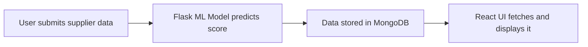

# 🚚 Supplier Performance Dashboard – From Chaos to Clarity

Once upon a time in a busy warehouse, supply chain managers were drowning in spreadsheets. Products were delayed, returns were frequent, and no one really knew which supplier was a hero — and who was the villain.

That’s when **we built this dashboard**.

> A full-stack solution powered by **machine learning**, designed to bring **clarity**, **accountability**, and **insight** into supplier performance.

---

## 🧠 The Intelligence Behind the Curtain

At the heart of the dashboard lies a **Python-powered ML model**.

It takes in data like:
- Delivery Time ⏱️
- QC Pass Rate ✅
- Return Rate 🔁
- Damage on Arrival 📦💥

And outputs a **Supplier Score** — a single number that tells you:  
*"Can I trust this supplier?"*

---

## 🔍 The Watchtower: React Frontend

From a sleek UI built in **React + Tailwind CSS**, users can:

- Filter suppliers by **region** or **product**
- Sort them by performance
- Instantly see:
  - 🌟 The best-performing supplier
  - ⚠️ The product with the worst QC
  - 📈 Score trends vs. last month

---

## 🛠️ The Backbone: Express + MongoDB

We use **Express.js** to build REST APIs, and **MongoDB** to store predictions and historical insights. Every ML prediction is saved in the `ml_output` collection, forming a logbook of supplier performance over time.

---

## 🔄 The Cycle



---

## ⚙️ How to Run the Magic

### 1. Clone the repository

```bash
git clone https://github.com/your-username/supplier-dashboard.git
cd supplier-dashboard
```

### 2. Start the Flask ML Backend

```bash
cd ml-backend
pip install -r requirements.txt
python app.py
```

### 3. Start the Node Backend

```bash
cd backend
npm install
npm run dev
```

### 4. Start the React Frontend

```bash
cd frontend
npm install
npm run dev
```

> Make sure `.env` files are set for each layer (Mongo URI, Flask URL, etc.)

---

## 🧭 Project Map

```
supplier-dashboard/
├── frontend/         # React app
├── backend/          # Node + Express API
├── ml-backend/       # Python + Flask ML service
└── README.md
```

---

## 🚀 Next on Our Journey

- [ ] Deploy to the cloud (Render, Railway, Vercel)
- [ ] Improve ML accuracy with more data
- [ ] Add user auth (Admin vs Viewer)
- [ ] Add supplier feedback + rating system

---

## 🧑‍💻 Built With Love by

- **Ayush Jha**  
📧 Contact us at: [ayu.jha321@example.com]  
🌐 [LinkedIn] · [GitHub]

- **Prateek Pathak**  
📧 Contact us at: [ayu.jha321@example.com]  
🌐 [LinkedIn] · [GitHub]

- **Ayush Srivastava** 
📧 Contact us at: [ayu.jha321@example.com]  
🌐 [LinkedIn] · [GitHub] 

- **Kuldeep Sharma**
📧 Contact us at: [ayu.jha321@example.com]  
🌐 [LinkedIn] · [GitHub]


---

> Let your supply chain make decisions based on data — not gut feelings.
